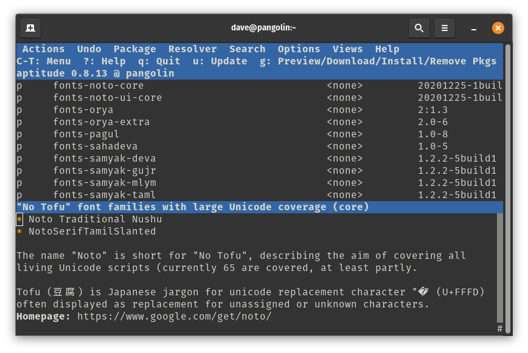

I don't know about you, but I only speak, read and write fluently in my native language: English. So when I go hunting for a font I don't want to see this:


Or this:


According to the [documentation](https://notofonts.github.io/noto-docs/), Noto provides "high-quality fonts for writing in all modern and ancient languages." So unless you're Tolkien you probably don't need it. And according to its [package description](https://code.launchpad.net/ubuntu/focal/+package/fonts-noto-core):

> The name "Noto" is short for "No Tofu"... Tofu (豆腐) is Japanese jargon for unicode replacement character "�" (U+FFFD)

Even after uninstalling it from my system, those Japanese characters appear to render correctly in the browser and in the terminal:



Now the Fonts app and font picker are more usable on my system.

I also removed a ton of extra language packages that were added to my system during its initial setup. Modify as desired if you speak the Queen's English or something else:

```bash
#!/usr/bin/env bash

aptitude purge --purge-unused \
    fonts-arphic-ukai \
    fonts-arphic-uming \
    fonts-noto-cjk \
    fonts-noto-cjk-extra \
    fonts-noto-core \
    fonts-noto-ui-core \
    gnome-user-docs-de \
    gnome-user-docs-es \
    gnome-user-docs-fr \
    gnome-user-docs-it \
    gnome-user-docs-ja \
    gnome-user-docs-pt \
    gnome-user-docs-ru \
    gnome-user-docs-zh-hans \
    hunspell-ar \
    hunspell-de-at-frami \
    hunspell-de-ch-frami \
    hunspell-de-de-frami \
    hunspell-en-au \
    hunspell-en-ca \
    hunspell-en-gb \
    hunspell-en-za \
    hunspell-es \
    hunspell-fr \
    hunspell-fr-classical \
    hunspell-it \
    hunspell-pt-br \
    hunspell-pt-pt \
    hunspell-ru \
    hyphen-de \
    hyphen-en-ca \
    hyphen-en-gb \
    hyphen-es \
    hyphen-fr \
    hyphen-it \
    hyphen-pt-br \
    hyphen-pt-pt \
    hyphen-ru \
    ibus-chewing \
    ibus-libpinyin \
    ibus-mozc \
    ibus-table-cangjie3 \
    ibus-table-cangjie5 \
    ibus-table-quick-classic \
    ibus-table-wubi \
    language-pack-ar \
    language-pack-ar-base \
    language-pack-de \
    language-pack-de-base \
    language-pack-es \
    language-pack-es-base \
    language-pack-fr \
    language-pack-fr-base \
    language-pack-gnome-ar \
    language-pack-gnome-ar-base \
    language-pack-gnome-de \
    language-pack-gnome-de-base \
    language-pack-gnome-es \
    language-pack-gnome-es-base \
    language-pack-gnome-fr \
    language-pack-gnome-fr-base \
    language-pack-gnome-it \
    language-pack-gnome-it-base \
    language-pack-gnome-ja \
    language-pack-gnome-ja-base \
    language-pack-gnome-pt \
    language-pack-gnome-pt-base \
    language-pack-gnome-ru \
    language-pack-gnome-ru-base \
    language-pack-gnome-zh-hans \
    language-pack-gnome-zh-hans-base \
    language-pack-gnome-zh-hant \
    language-pack-gnome-zh-hant-base \
    language-pack-it \
    language-pack-it-base \
    language-pack-ja \
    language-pack-ja-base \
    language-pack-pt \
    language-pack-pt-base \
    language-pack-ru \
    language-pack-ru-base \
    language-pack-zh-hans \
    language-pack-zh-hans-base \
    language-pack-zh-hant \
    language-pack-zh-hant-base \
    libchewing3 \
    libchewing3-data \
    libmarisa0 \
    libopencc-data \
    libopencc1.1 \
    libpinyin-data \
    libpinyin13 \
    libreoffice-help-de \
    libreoffice-help-en-gb \
    libreoffice-help-es \
    libreoffice-help-fr \
    libreoffice-help-it \
    libreoffice-help-ja \
    libreoffice-help-pt \
    libreoffice-help-pt-br \
    libreoffice-help-ru \
    libreoffice-help-zh-cn \
    libreoffice-help-zh-tw \
    libreoffice-l10n-ar \
    libreoffice-l10n-de \
    libreoffice-l10n-en-gb \
    libreoffice-l10n-en-za \
    libreoffice-l10n-es \
    libreoffice-l10n-fr \
    libreoffice-l10n-it \
    libreoffice-l10n-ja \
    libreoffice-l10n-pt \
    libreoffice-l10n-pt-br \
    libreoffice-l10n-ru \
    libreoffice-l10n-zh-cn \
    libreoffice-l10n-zh-tw \
    mozc-utils-gui \
    mythes-ar \
    mythes-de \
    mythes-de-ch \
    mythes-en-au \
    mythes-es \
    mythes-fr \
    mythes-it \
    mythes-pt-pt \
    mythes-ru \
    wbrazilian \
    wbritish \
    wfrench \
    witalian \
    wngerman \
    wogerman \
    wportuguese \
    wspanish \
    wswiss
```

Note the following packages were not included in the script above:

* hunspell-en-us
* hyphen-en-us
* language-pack-en
* language-pack-gnome-en
* libreoffice-help-en-us
* mythes-en-us
* wamerican

Also note I'm running Pop!_OS, which might include different packages than Ubuntu.

